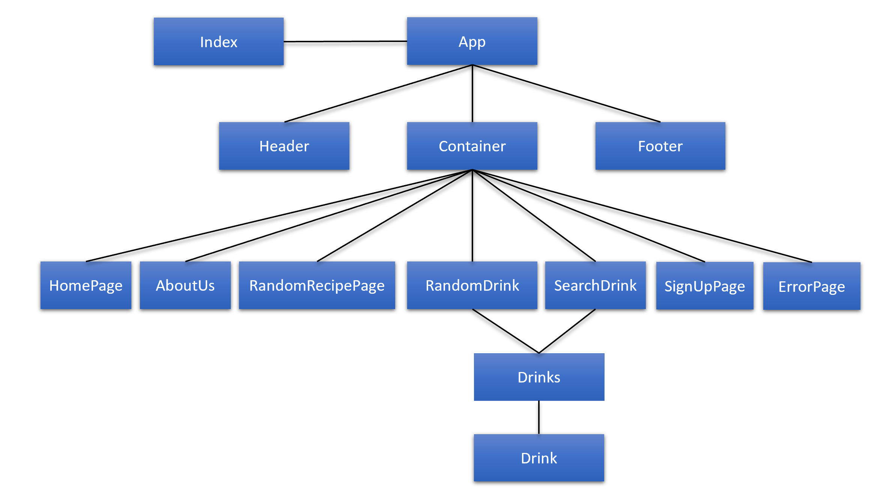

# VPS Project

# Welcome to the VPS Project! This was a collaborative app built in React. This app utilizes two different API's to generate random recipes and drinks for any user to explore through and enjoy! Within the app, there also exists a method of searching for specific drinks to match the randomly generated recipe! Don't like what you got? Just roll again! The purpose of this app is to give freedom to the user to choose and look through thousands of different recipes, to find one that suits them best!

## Component Hierarchy

## Wireframe

## API's used:
Spoonacular: https://spoonacular.com/food-api/docs

TheCocktailDB: https://www.thecocktaildb.com/api.php

## Dependencies used:
Axios, react-router-dom

## MVP
The developed app has the following capabilities: Home Page | About Us | Random Drink | Search for a Drink | Random Recipe | Sign-Up; the drink and recipe pages will further showcase images of the generated recipes for the user to view, and eat, or drink, with their eyes!

# SWOT Analysis
Strengths: The strengths of the app lie in the logic behind the api calls, allowing for the user to freely generate multiple recipes and search through recipes involving various ingredients to find exactly what they prefer!
Weaknesses: Some weaknesses of the app include the sign-up page not being fully finished, and thus not being a viable capability at the time.
Opportunities: This app could potentially be used by people globally to view and explore recipes from outside of their comfort zone! With the ability to view collected recipes from all over the world, the possibilities might just be endless!
Threats: The largest threat of the API is the Spoonacular API being rate-limited, and as such might incur heavy costs relevent to the amount of traffic tha app gets.

# POST-MVP
Some future goals for this project include a wider incorporation in terms of availability, as well as increasing the limit on the amount of API calls made per day with the Spoonacular API. Other future implementations also include adjusting readability and design with togglable color schemes, and maybe even customizable font styles or sizes. Finally, the most luxirous post-mvp goal for this project would be development into a full-blown app, with a functioning sign-up.
